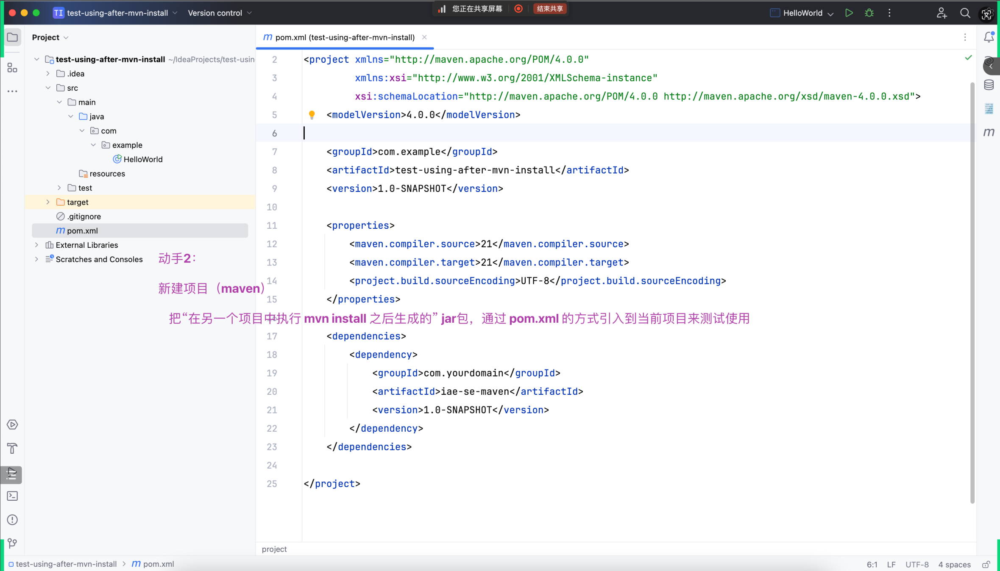

## 回顾

见上次课的笔记

## 由昨天 `.gitignore` 额外引出

- 
- 从本质上理解为什么可以忽略它、删除它
    - .idea
    - target
    - #08e487c8 直接删了 lib
- `临界条件` 的思路
    - 比如：假设 gitee 每个仓库超过 5M 就要收费 => ...

## 通过 GAV 唯一定义

- 
    - https://maven.apache.org/guides/getting-started/index.html
- 
    - https://maven.apache.org/guides/mini/guide-naming-conventions.html
    - 《Java 开发手册》

## 可以开始准备域名了

- 

## 合并两条commit的方法

- 

## 查找commit纪录方法

`git reflog --date=iso`

## 回退commit操作

`git reset --hard 【具体要回退到哪个commit xxxxxxx (比如2aabfa4)】`

## git出现了冲突

- 
- 

## 无法解决冲突

- 
- 终止命令 ==> `git rebase --abort`

## 代码打包给别人用

- 

## Test方法

- 

## JUnit5测试工具

- 

## 动手一,非maven导入jar包来测试使用

- 

### 方法如下

#### 在自己的项目运行package生成jar包

- 

#### 在新的项目导入jar包

- 

## 动手二,maven导入GAV来测试使用

- 

### 方法如下

#### 在自己的项目运行install生成GAV

- 

#### 在自己的项目复制GAV

- 

### 在新的项目导入GAV

- 

## 附加题

- 
- 目的:让自己从 `消费者` 转变为 `生产者`,不要只是成为台下的看客,合适的时候应该上台