## 如何把自己写好的代码 (Artifact) 分享出去
- 

## 为什么没有引入mysql依赖,但编辑器没报错
- 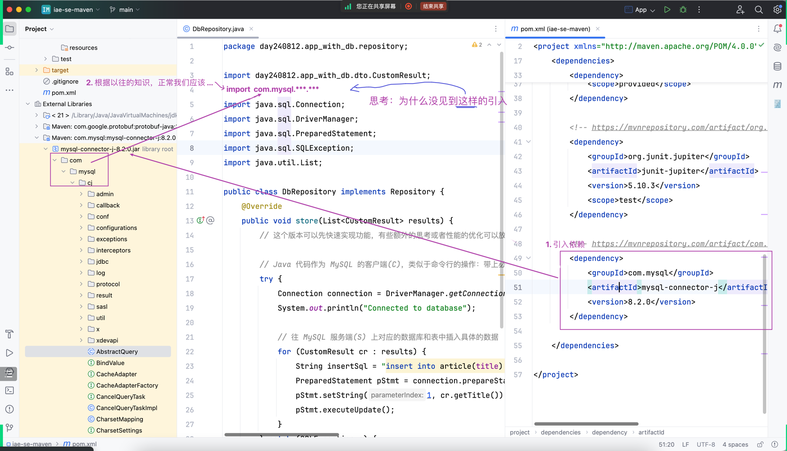
## 编辑器没报错,但是运行报错了
- 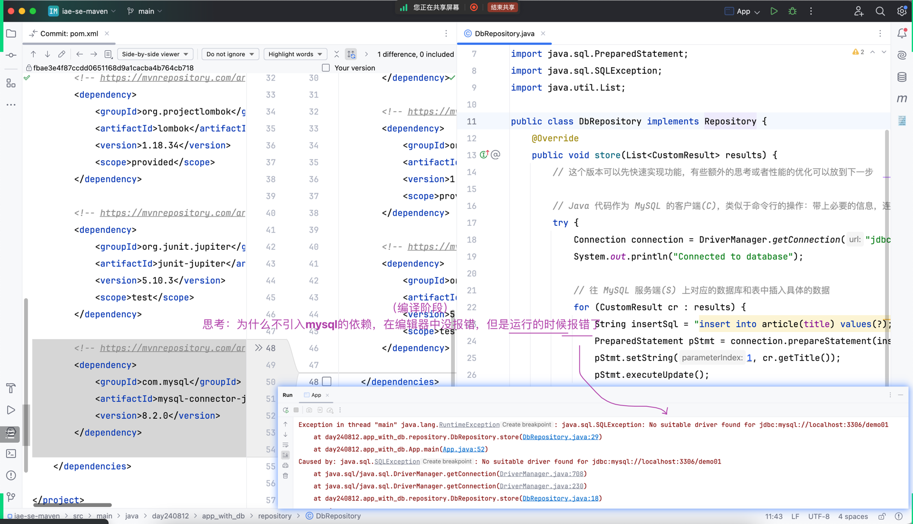

### 参考答案
- 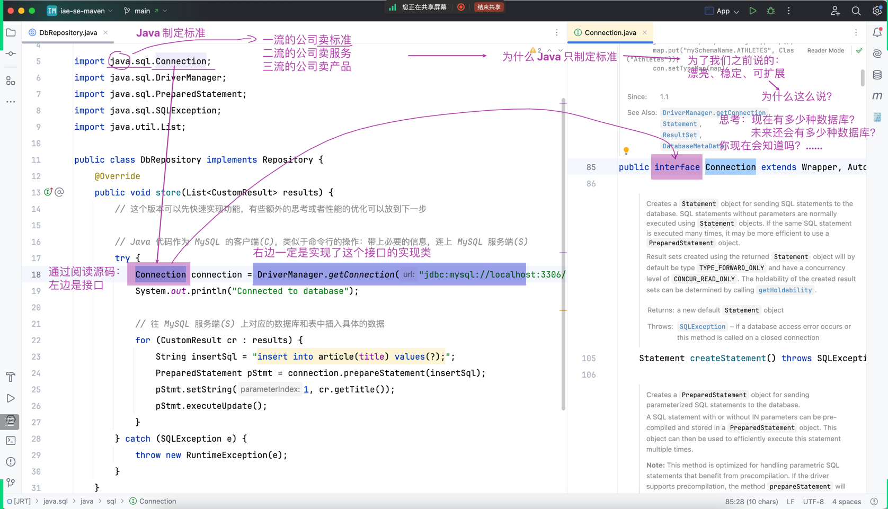
- 
  - 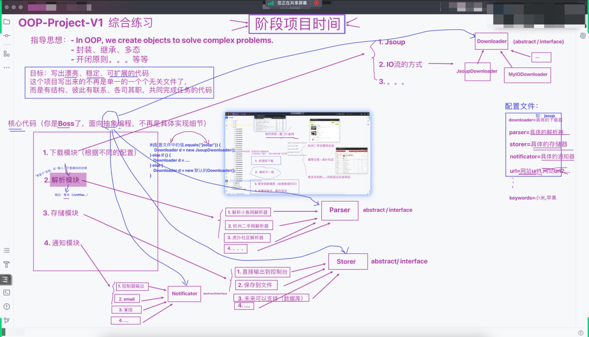
- 到了 JavaEE，到处都是 `接口` 和 `实现类` 之前的关系。而且 Java 只定义规范

### 验证过程
- 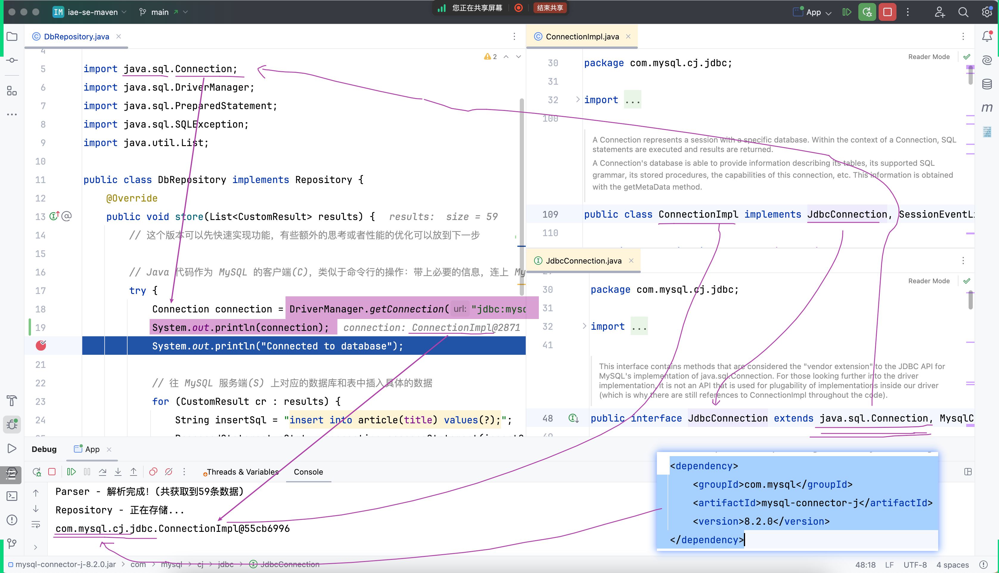

## 阅读一手资源之 JDBC
- 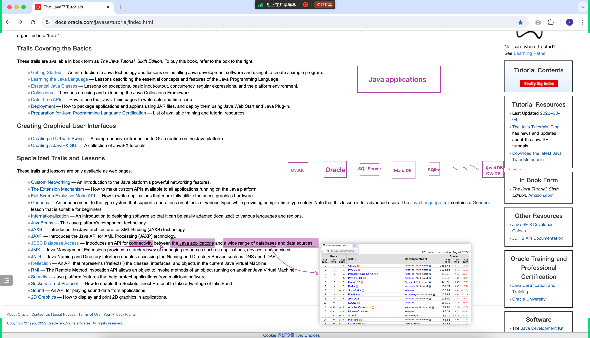
- 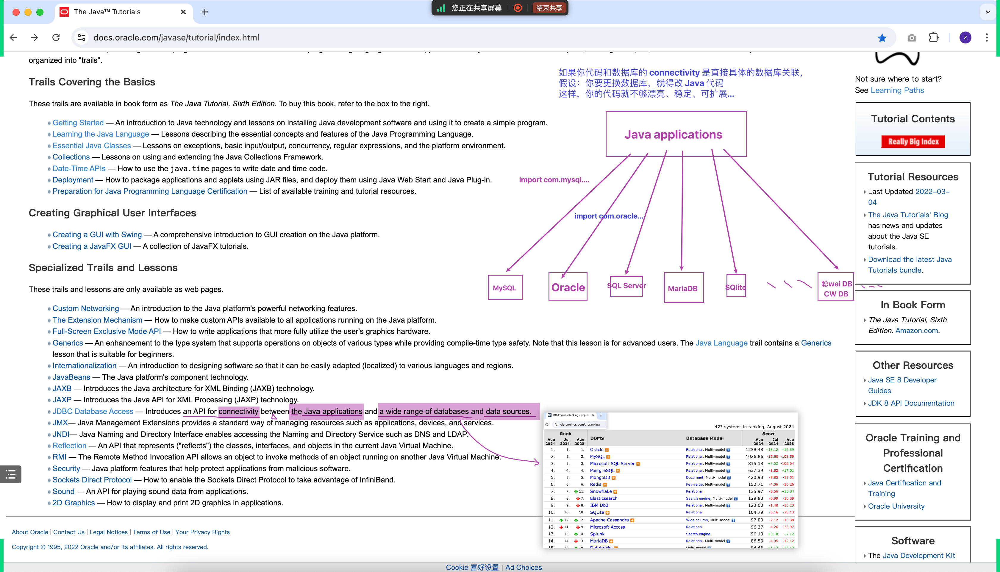
- 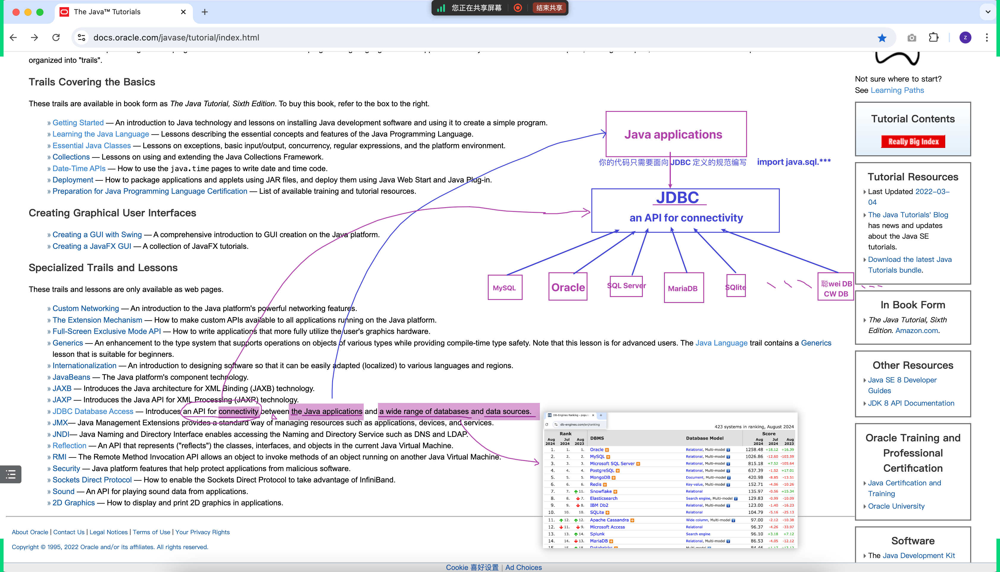
- JDBC（Java Database Connectivity）是 Java 标准库中用于与数据库进行交互的 API。它允许 Java 应用程序连接到各种不同的数据库管理系统（DBMS），执行 SQL 查询和更新操作，以及处理数据库事务。

## 编写 JDBC 单元测试代码
- 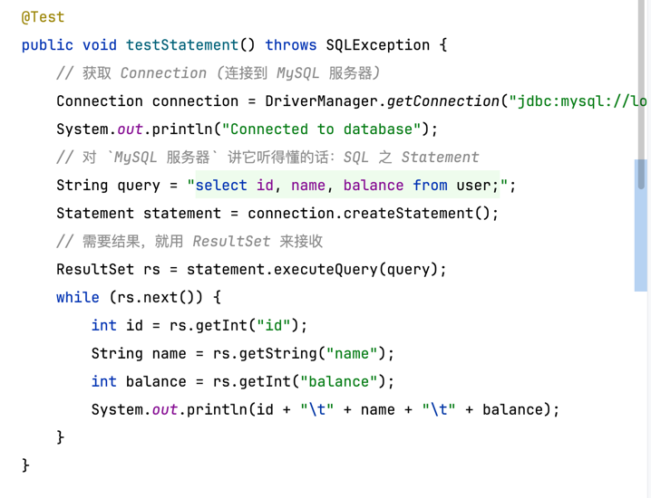
- 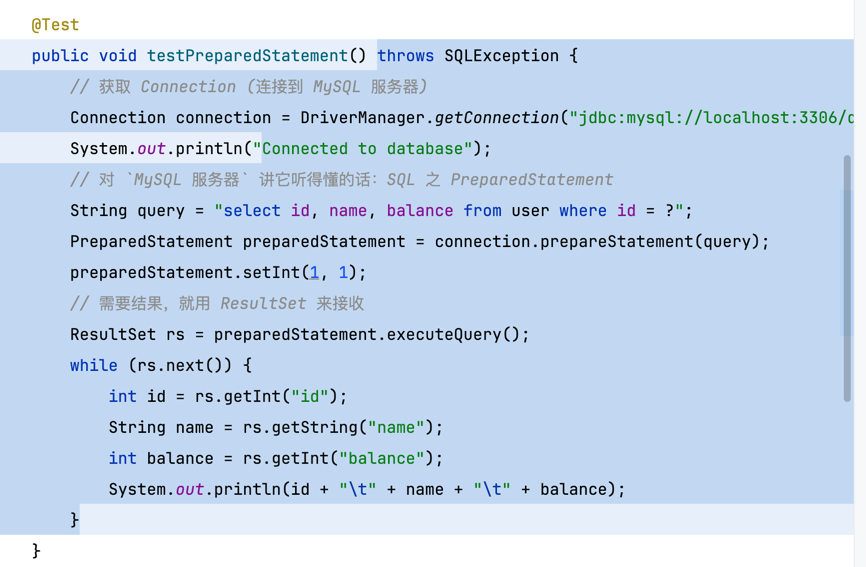
- 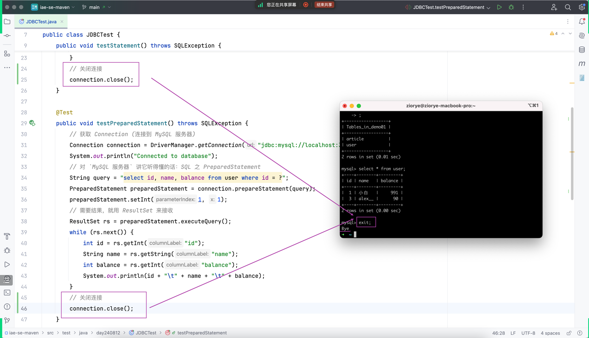

### 引出 JUnit5 的 @BeforeAll 和 @AfterAll
- 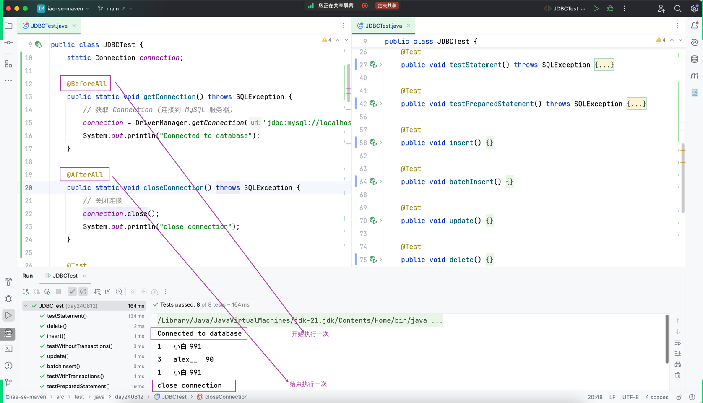

### 复习之前在命令行敲过的 SQL
- mysql -uroot -p
- show databases;
- use demo01;
- show tables;
- select * from article;
- delete from article;
- exit;

### 事务 Transaction
- 在两段数据的过程中如果报错就会有一段数据丢失，这是大忌，但是我们有办法解决他
- 运行代码前关闭自动commit `connection.setAutoCommit(false);`
- 在两端数据结束的位置 `connection.commit();`
- finally最后 `connection.setAutoCommit(true);`

## 今日代码小结
- 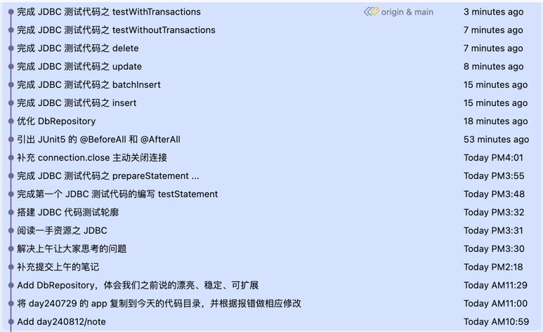

