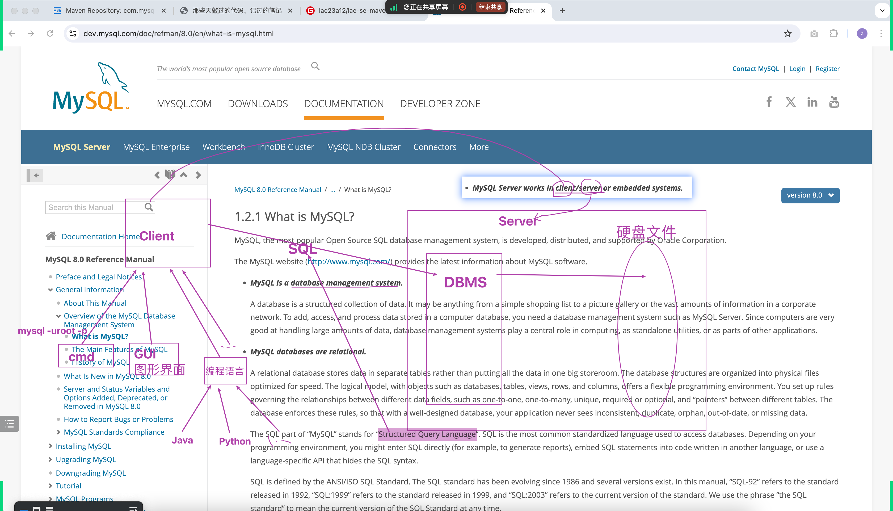
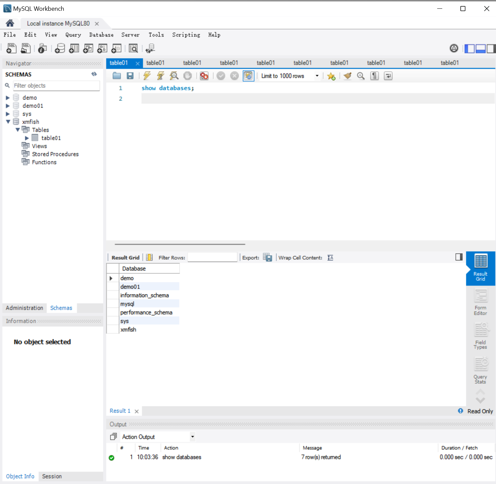
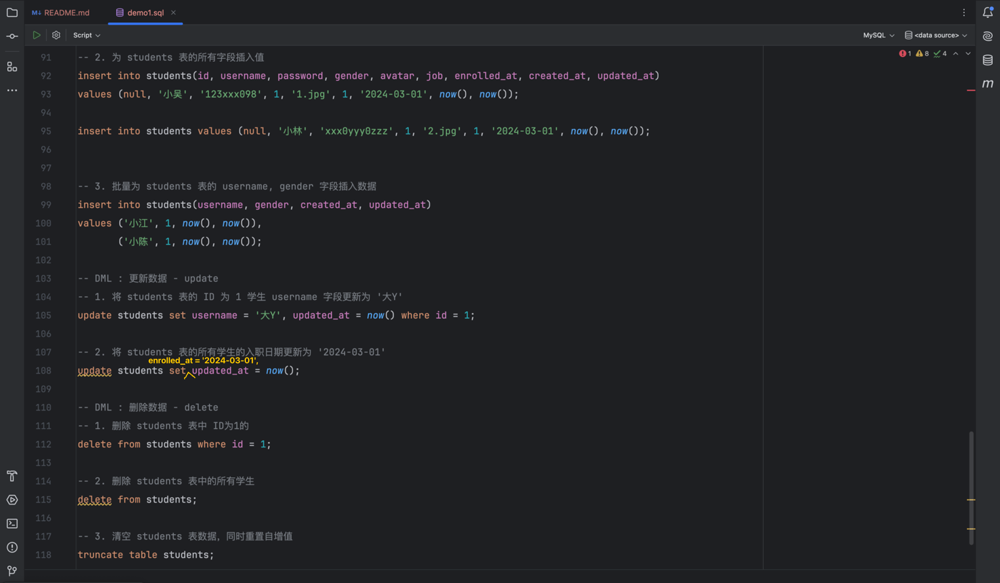
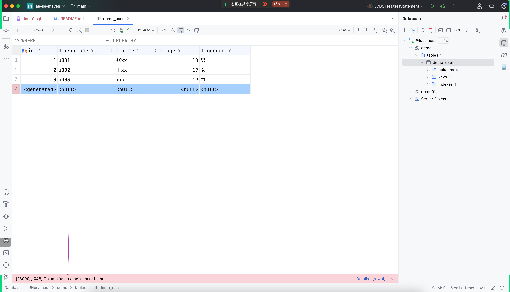
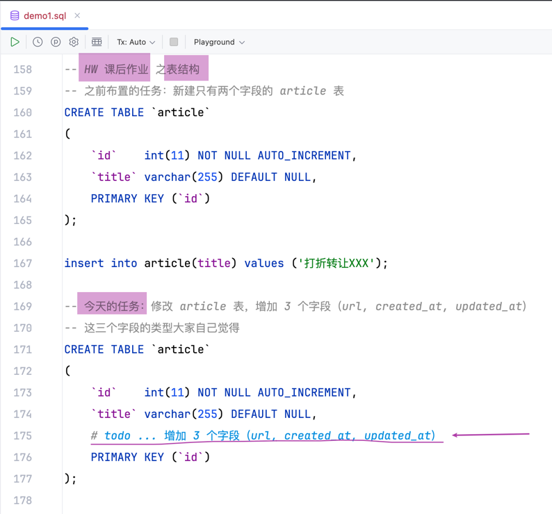

## 回顾
见上次课的笔记

## 从之前画过的一张图开始
- 
- 引出：通过`图形界面`连接到`MySQL 服务器`
- MySQL数据的图形界面客户端也非常多（到处都是接口和实现类的关系）

## 用 `IntelliJ IDEA` 编辑器自带的`可视化数据库管理`软件
- 
- 备选方案
  - 
  - 
  - 还有很多 GUI 图形界面客户端

- New `Data Source` -> `MySQL` 
  - 
  - Download missing driver files
  
- 可能遇到的问题
  - 
  - 解决方法：切换网络再重试
- 测试连接情况
  - 

## `0 of xxx` Click here to display other schemas
- 

## 在 console 执行 SQL 命令，体验自动提醒功能
- 

## `命令行` vs `GUI` 本质是一致
- 

## 创建表的模板格式
- 

## GUI 可视化操作之后对应的 SQL 语句
- 
- 

## MySQL 关键字的大小写写法格式
- 

## 基础的增删改操作
- 
- 

## 课上其他截图
- 创建表的类比

- `show create table xxx`

- `not null` 约束
  - 
  - 
- `default`

- `unique`

- 动手时间

- 通过 GUI 创建表
  - 
  - 
  - 
  - 
- `update 和 delete` 与 `where` 更配哦
  - 
- 数据类型及相关文档
  - 

## 课后作业
- 
#### 数据库
- 帖子内容表
  - 
- 配置表
  - 
- 任务表（附加作业）
  - 
  - 
### 代码
分版本完成
- app_with_data_v2（把采集回来的 title, url, created_at, updated_at 都存储到新增加的 article 表）
- app_with_data_v3（将之前读取`配置文件`改成读取新规划的`配置表`）
- app_with_data_v4（附加作业，选做）
