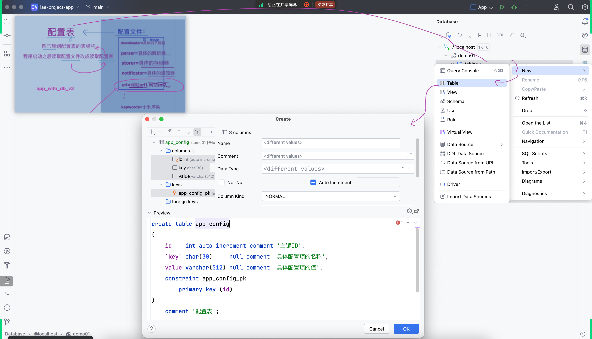

## 补充
之前的两个项目上传到了 `GitHub`，开启 `它提供的 GitHub Pages`
- https://iae666b.github.io/iae-study-journal/
  - 
- https://iae666b.github.io/code-execution-timer
  - 

## 作业参考答案
### 创建了一个新仓库 `iae-project-app`
把 `app_with_db` 从原来的子包中独立出来
- 
### 隐藏在作业背后的点
复习 `创建表`、`修改表结构`等操作
- app_with_db_v2
  - 
- app_with_db_v3
  - 
### 扩展点
- 

## 常用的查询语法
- 课件中的英文注释依旧是来自官方的一手资源
  - 
- 脑补枯燥数据背后的可能
  - 
  - 
- `case ... when ...`
  - 
  - 