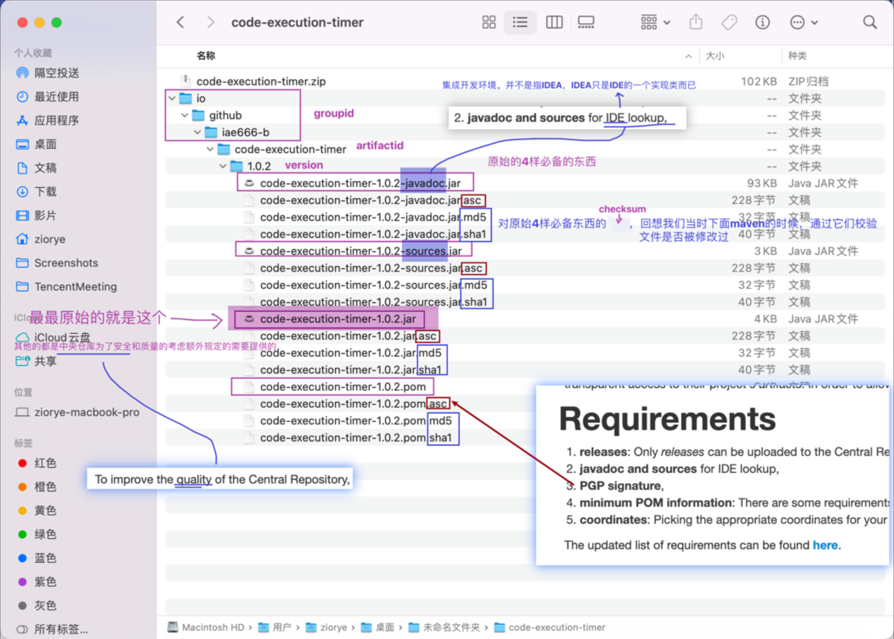
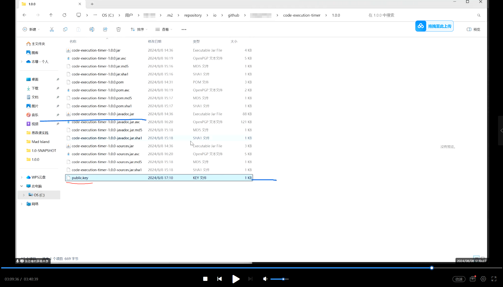

## maven如何上传远程给别人用

### 需要准备的材料
- 五个需求

### 需要按一定文件组织结构存放起来

#### 上传需要的文件

#### 提供Java文档和源代码，遵循Maven存储库格式(sources & javadoc)

- 生成方式

#### 生成.asc文件

1. 手动生成 
- 待完善
2. 自动生成
- 用maven插件,自动生成 `PGP signature`

#### 上传密钥
1. 首先到官网下载GnuPG
https://gnupg.org/download/index.html
2. 在.m2你要上传的文件中打开命令行输入 `gpg --list-keys` 获取密钥

- 继续在命令行输入 `gpg -a -o public.key --export (刚才你获取的密钥)`

- 
- 成功在.m2里生成公钥
3. 将你的密钥发送出去
- 打开网址
https://keyserver.ubuntu.com

- 复制公钥传到网站上

4. 在网站上搜索密钥验证是否上传成功

#### maven上传对POM文件的一些要求
- 传入pom中

#### 上传中央仓库方式
https://central.sonatype.com/

1. 手动上传
- 压缩准备的四个文件
- 
2. 自动上传
引入依赖自动上传中央仓库
- mvm deploy
- 额外会自动帮我们生成 ***.md5 , ***.sha1

